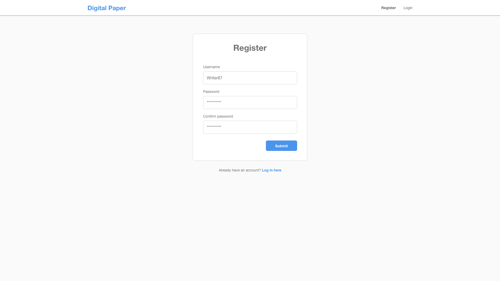
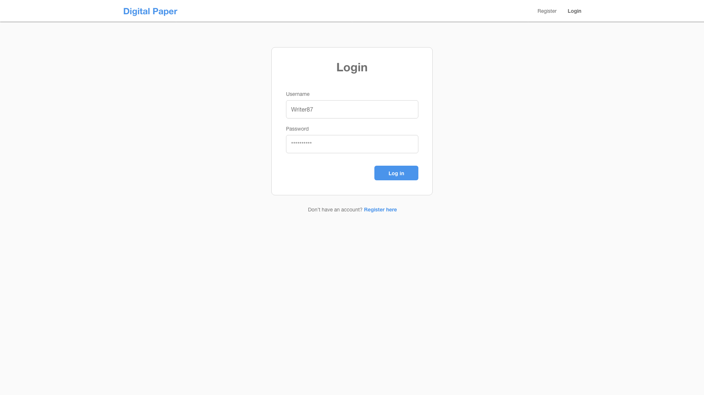
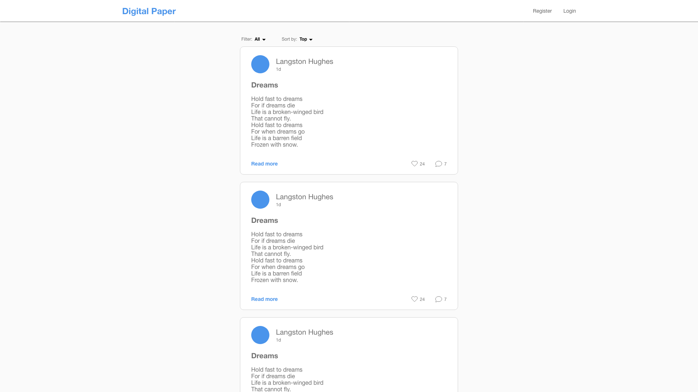
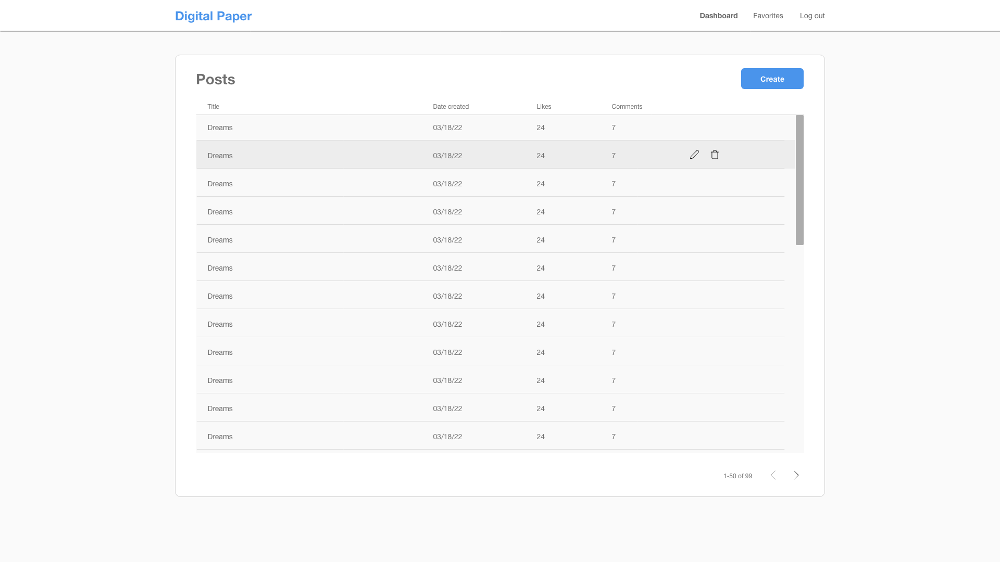
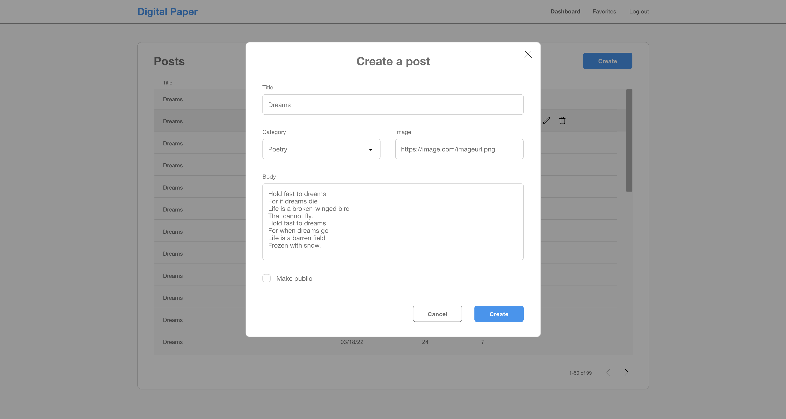

# Digital Paper

> A web application for everyone to write and post poetries, stories, daily journals, etc.

This is a full stack application using the MEVN stack. Anyone can sign up and post any type of written piece either to share with the public or keep for themselves privately.

## Deployed Application / Live Demo

In progress...

## Demos / GIFS

## User Stories

```
AS A writer
I WANT a content management system web application that allows me to post my stories online
SO THAT I can share them with everyone
```

## Acceptance Criteria

```
GIVEN the application as a logged out user (visitor)
WHEN I arrive on the home screen
THEN I am presented with a wall of posts shared by other users
...

GIVEN the application as a logged in user
WHEN...
THEN...
```

## Mockups

  
  
  
  

